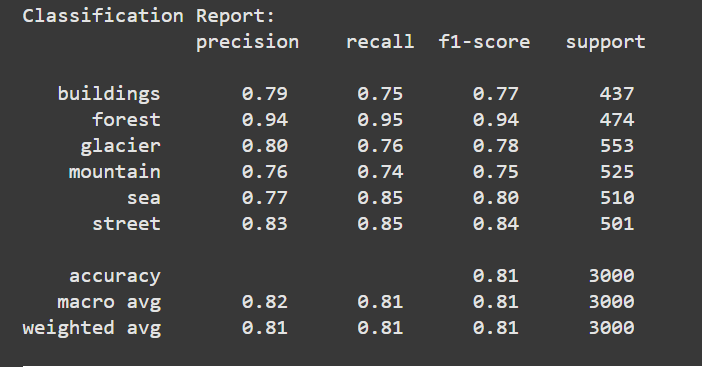
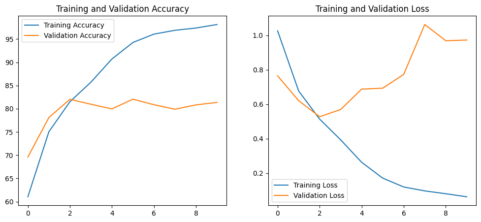
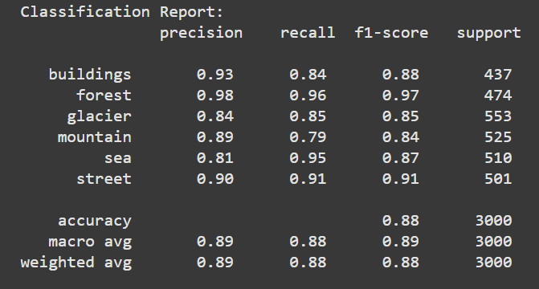
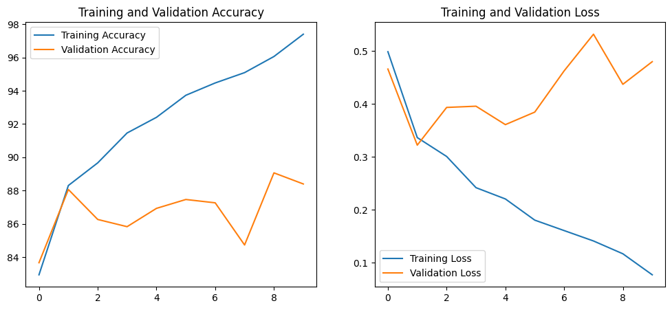
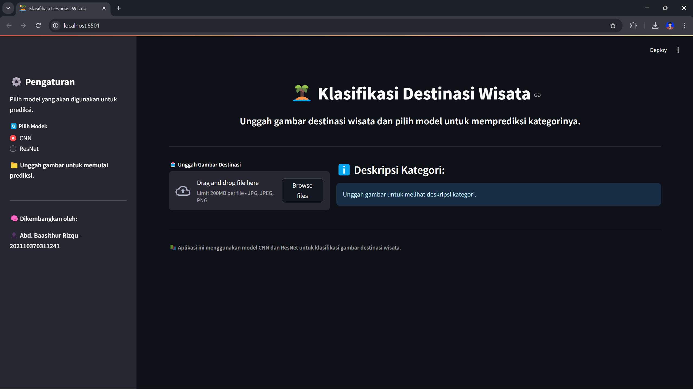
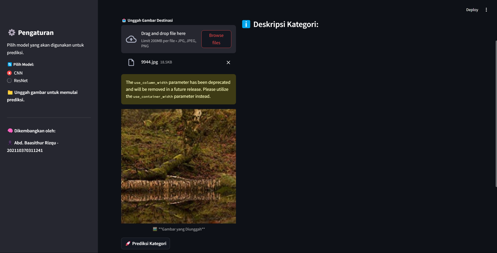
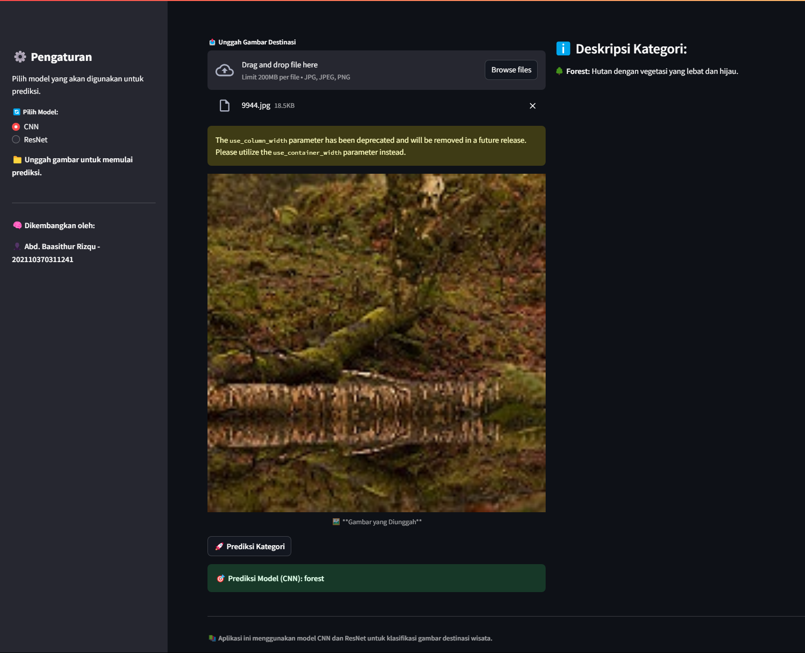

# Klasifikasi Jenis Destinasi Wisata Menggunakan Model CNN dan ResNet
## (Abd. Baasithur Rizqu - 202110370311241)
## Overview Project
Proyek ini bertujuan untuk mengembangkan sebuah sistem untuk mengklasifikasikan jenis-jenis destinasi wisata menggunakan model deep learning, khususnya Convolutional Neural Networks (CNN) dan ResNet (Residual Networks). Model klasifikasi ini digunakan untuk mengidentifikasi gambar dari berbagai destinasi wisata, yang membantu dalam mengotomatisasi kategorisasi lokasi berdasarkan fitur visual yang ada pada gambar. Proyek ini memanfaatkan model pre-trained seperti ResNet untuk meningkatkan akurasi dan performa tugas klasifikasi gambar.

## Overview Dataset

Dataset yang digunakan dalam proyek ini adalah **Intel Image Classification Dataset**, yang tersedia di Kaggle. Dataset ini berisi gambar yang dikategorikan ke dalam enam jenis scene, yaitu:

- Bangunan (Buildings)
- Hutan (Forest)
- Gletser (Glacier)
- Gunung (Mountain)
- Laut (Sea)
- Jalan (Street)

Setiap gambar diberi label berdasarkan jenis destinasi yang digambarkannya, yang berguna untuk pelatihan dan evaluasi model klasifikasi. Dataset ini sudah dibagi menjadi set pelatihan dan pengujian, yang memungkinkan evaluasi performa model dengan lebih baik.

**Link ke Dataset**: [Intel Image Classification Dataset](https://www.kaggle.com/datasets/puneet6060/intel-image-classification)

## PREPROCESSING DAN MODELLING
#### Preprocessing
Preprocessing yang dilakukan adalah _resizing_(224, 224), lalu melakukan _normalization_, dilanjut dengan melakukan _splitting data_ pada setiap model.
#### Modelling
##### Convolutional Neural Networks (CNN)
Hasil dari CNN Model yang telah dilakukan...

Gambar diatas menunjukkan hasil dari _Classification Report_ dari model CNN. Dimana pada bagian akurasinya mencapai 81% dengan hasil prediksi paling tinggi terdapat pada label '_forest_' dengan akurasi 94% dan paling rendah terdapat pada label '_mountain_' dengan akurasi 77%.

Plot diatas menunjukkan bahwa training acc meningkat dari 60% sampai 95%, namun validation acc nya mengalami fluktuatif acc pada rentang 70% hingga 80%. Dan menunjukkan bahwa loss dari training set menurun dari 1.0 ke 0 sedangkan val_loss nya mengalami fluktuatif dengan rentang loss antara 0.6 hingga 1.0 .
##### Residual Networks (ResNet)
Hasil dari ResNet Model yang telah dilakukan...

Gambar diatas menunjukkan hasil dari _Classification Report_ dari model ResNet. Dimana pada bagian akurasinya mencapai 88% dengan hasil prediksi paling tinggi terdapat pada label '_forest_' dengan akurasi 98% dan paling rendah terdapat pada label '_sea_' dengan akurasi 81%.

Plot diatas menunjukkan bahwa training acc meningkat dari 84% sampai 97%, namun validation acc nya mengalami fluktuatif acc pada rentang 84% hingga 88%. Dan menunjukkan bahwa loss dari training set menurun dari 0.5 ke 0.1 sedangkan val_loss nya mengalami fluktuatif dengan rentang loss antara 0.3 hingga 0.5 .
## Local Web Deployment
### Tampilan HomePage

### Tampilan HomePage Setelah Upload Image

### Tampilan Prediction Reslut

## Implementasi dilakukan menggunakan Keras dan TensorFlow, memanfaatkan model pre-trained untuk meningkatkan performa dan mengurangi waktu pelatihan.

### Requirements

- Python 3.x
- TensorFlow
- Keras
- NumPy
- Matplotlib
- OpenCV
